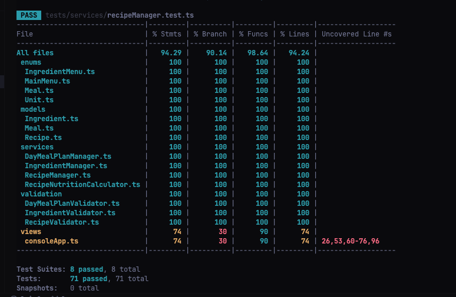

Första planen var att göra en konsollapplikation som senare skulle bli en webb applikation.
Applikationen ska fungera som en "Matdagbok", typ som "Lifesum".
Den ska låta användaren lägga in livsmedel med näringsinnehåll, skapa recept och måltider och få ut kalorier samt eventuella näringsinnehåll.

Jag började lite i fel ändå, jag har ingen konsollmeny eftersom jag implementerade allting annat före, hantering av livsmedel, recept och måltider. jag skulle tagit en "meny" i taget.

jag har använt mig av dependency injection i Meal exempelvis för att få tillgång till recept. jag har även IngredientManager i konstruktorn på RecipeNutritionCalculator

## Använda verktyg

- **Språk:** TypeScript
- **Testverktyg:** Jest
- **Mockning:** Jest Mock Functions
- **Kodformattering:** Prettier och ESLint
- **Kodtäckning:** Jest Coverage
- **Versionshantering:** Git

## Code coverage



## Requirements Traceability Matrix

Här är de kraven som jag direkt kan sätta på tester. Jag har utgått från kravlistan när jag har skrivit testerna, men jag skulle skrivit kraven mer detaljerat och exempelvis inkluderat all felhantering. Testerna testar mer än vad kraven beskriver.

| Requirement ID | Description                | Test File                         | Test Description                                |
| -------------- | -------------------------- | --------------------------------- | ----------------------------------------------- |
| REQ-001        | Add new recipe             | recipeManager.test.ts             | "should create a recipe with basic information" |
| REQ-002        | List recipes for meal type | dayMealPlanManager.test.ts        | "should list meals for a specific meal type"    |
| REQ-003        | Delete recipe              | recipeManager.test.ts             | "should delete a recipe"                        |
| REQ-005        | Plan meals for a day       | dayMealPlanManager.test.ts        | "should add a meal to the day meal plan"        |
| REQ-006        | Connect meals to recipes   | dayMealPlanManager.test.ts        | "should add a meal to the day meal plan"        |
| REQ-009        | Add new ingredient         | ingredientManager.test.ts         | "should add a new ingredient"                   |
| REQ-011        | Update ingredient          | ingredientManager.test.ts         | "should update existing nutrition information"  |
| REQ-012        | Delete ingredient          | ingredientManager.test.ts         | "should delete an existing ingredient"          |
| REQ-018        | Calculate meal calories    | recipeNutritionCalculator.test.ts | "should calculate calories for a recipe"        |

## Dependency Injection

Här är exempel på två ställen som jag använder dependeny injection.

1. DayMealPlanManager:

```typescript
export class DayMealPlanManager {
  constructor(private recipeManager: RecipeManager) {
    this.validator = new DayMealPlanValidator(recipeManager)
  }
}
```

2. RecipeNutritionCalculator:

```typescript
export class RecipeNutritionCalculator {
  constructor(private ingredientManager: IngredientManager) {}
}
```

## Mocking Implementation

Exempel på var jag använder mocking

1. **Class Mocking**: Här har jag använt mocking av klassen som validerar DayMealPlan för att simulera valideringen utan att köra dess faktiska logik. Genom att göra så har jag kunnat testa DayMealPlan utan att trigga felen som fångas i valideringen

```typescript
jest.mock('../../src/validation/DayMealPlanValidator', () => {
  return {
    DayMealPlanValidator: jest.fn().mockImplementation(() => ({
      validateMealType: jest.fn(),
      validateRecipeId: jest.fn(),
      validateRecipeExists: jest.fn(),
      validateDate: jest.fn(),
    })),
  }
})
```

2. **Method Mocking**: Här har jag mockat specifika metoder hos RecipeManager i DayMealPlan, så anrop till exempelvis getRecipe kommer alltid att returnera `mockSimpleRecipe` som är ett mockat recept.

```typescript
mockRecipeManager = {
  getRecipes: jest.fn().mockReturnValue([mockSimpleRecipe]),
  getRecipeById: jest.fn().mockReturnValue(mockSimpleRecipe),
  createRecipe: jest.fn(),
} as unknown as jest.Mocked<RecipeManager>
```

3. **spyOn**: Här "spionerar" jag på log-metoden i console-klassen för att se om "Main Menu" förekommer i console.log

```typescript
const consoleSpy = jest.spyOn(console, 'log')
menu.displayMainMenu()
expect(consoleSpy).toHaveBeenCalledWith(expect.stringContaining('Main Menu'))
```

## System Under Test (SUT) Classes

#### 1. IngredientManager

**Ansvar**: Hantering av ingredienser och deras egenskaper.

**Huvudfunktioner**:

- Skapa nya ingredienser
- Lista alla ingredienser
- Ta bort ingredienser
- Hantera näringsvärden
- Beräkna kalorier per enhet

**Beroenden**:

- IngredientValidator

**Testtäckning**: ~100%

```typescript
export class IngredientManager {
  private ingredients: Ingredient[] = []
  private validator = new IngredientValidator()

  createIngredient(name: string, caloriePerHundredGram: number): Ingredient
  getIngredients()
  deleteIngredient(id: string)
  setDetailedNutritions(id: string, nutrition: {...})
  calculateCaloriesPerUnit(id: string): number
}
```

#### 2. RecipeManager

**Ansvar**: Hantering av recept och deras komponenter.

**Huvudfunktioner**:

- Skapa nya recept
- Lista alla recept
- Ta bort recept
- Hantera ingredienser i recept
- Validera receptstrukturer

**Beroenden**:

- RecipeValidator

**Testtäckning**: ~100%

```typescript
export class RecipeManager {
  private recipes: Recipe[] = []
  private validator = new RecipeValidator()

  createRecipe(name: string, ingredients: {...}[], instructions: string, servings: number): Recipe
  getRecipes()
  deleteRecipe(recipeId: string)
}
```

#### 3. DayMealPlanManager

**Ansvar**: Hantering av måltidsplanering och schemaläggning.

**Huvudfunktioner**:

- Lägga till måltider
- Hämta måltider för specifik dag
- Ta bort måltider
- Koppla recept till måltider
- Validera måltidsplanering

**Beroenden**:

- RecipeManager
- DayMealPlanValidator

**Testtäckning**: ~100%

```typescript
export class DayMealPlanManager {
  private meals: MealModel[] = []

  constructor(private recipeManager: RecipeManager)
  addMeal(date: Date, mealType: MealType, recipeId: string)
  getMealsForDate(date: Date)
  deleteMealFromDateAndMealType(date: Date, mealType: MealType, recipeId: string)
}
```

#### 4. RecipeNutritionCalculator

**Ansvar**: Beräkning av näringsvärden för recept.

**Huvudfunktioner**:

- Beräkna kalorier per portion
- Beräkna detaljerade näringsvärden
- Aggregera ingrediensers näringsvärden

**Beroenden**:

- IngredientManager

**Testtäckning**: ~100%

```typescript
export class RecipeNutritionCalculator {
  constructor(private ingredientManager: IngredientManager)
  getCaloriesPerPortion(recipe: Recipe): number
  getDetailedNutritionPerPortion(recipe: Recipe)
}
```

#### 5. ConsoleMenu (View)

**Ansvar**: Hantering av användargränssnittet i konsolen.

**Huvudfunktioner**:

- Visa huvudmeny
- Hantera användarinput
- Visa ingrediensmeny
- Validera menyval

**Beroenden**:

- IngredientManager

**Testtäckning**: ~90%

```typescript
export class ConsoleMenu {
  constructor(private ingredientManager: IngredientManager)
  displayMainMenu(): void
  handleMenuAction(option: MainMenuOption): void
  displayIngredientMenu(): void
}
```

#### Validatorer (Supporting SUTs)

##### 1. IngredientValidator

**Ansvar**: Validering av ingrediensdata

**Huvudfunktioner**:

- Validera ingrediensnamn
- Validera kalorivärden
- Validera näringsinnehåll

##### 2. RecipeValidator

**Ansvar**: Validering av receptdata

**Huvudfunktioner**:

- Validera receptnamn
- Validera ingredienslista
- Validera instruktioner
- Validera portioner

##### 3. DayMealPlanValidator

**Ansvar**: Validering av måltidsplanering

**Huvudfunktioner**:

- Validera måltidstyper
- Validera datum
- Validera receptreferenser

## testHelpers

**Syfte**: Denna filen innehåller hjälpmetoder för att skapa och hantera testdata. Tanken var att det skulle skapa en kontinuitet och minska koddupliceringen

#### Nyckelmetoder

##### 1. setupIngredientFromMock

- Skapar standardiserade ingredienser med förutbestämda näringsvärden
- Används som byggstenar för alla recept-tester

```typescript
const egg = setupIngredientFromMock('egg', ingredientManager)
```

##### 2. Recept-Generators

Flera metoder för att skapa standardrecept:

- `setupRecipeOmelette()`: Grundläggande recepttest
- `setupRecipePorridge()`: Frukosttester
- `setupRecipePancakes()`: Mer komplexa recept

```typescript
const recipe = setupRecipeOmelette(ingredientManager)
```

#### Användningsområden

1. **Näringsberäkningar**

```typescript
const recipe = setupRecipeOmelette(ingredientManager)
const calories = calculator.getCaloriesPerPortion(recipe)
```

2. **Måltidsplanering**

```typescript
const breakfast = setupRecipePorridge(ingredientManager)
const lunch = setupRecipeOmelette(ingredientManager)
```

#### Mock Data

Använder ett centralt `mockNutrition`-objekt med standardvärden för:

- Kalorier
- Proteiner
- Fetter
- Kolhydrater
- Mängd per enhet
